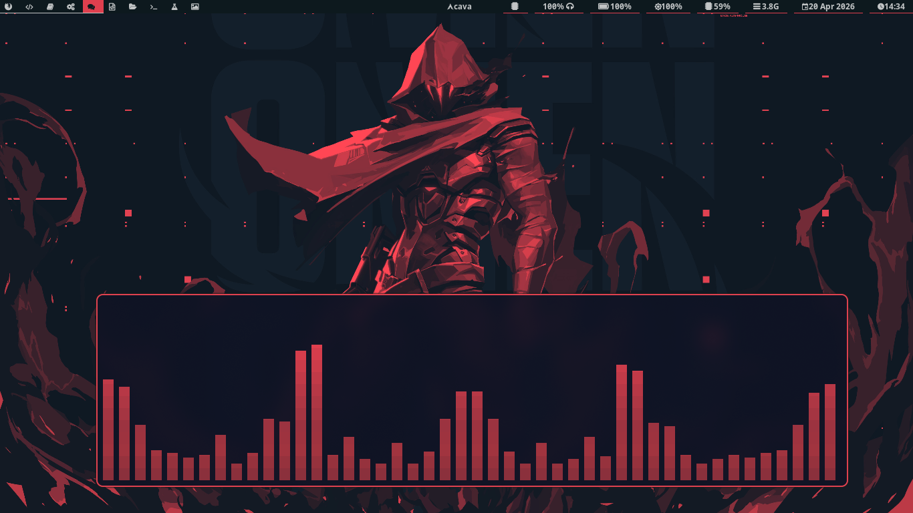
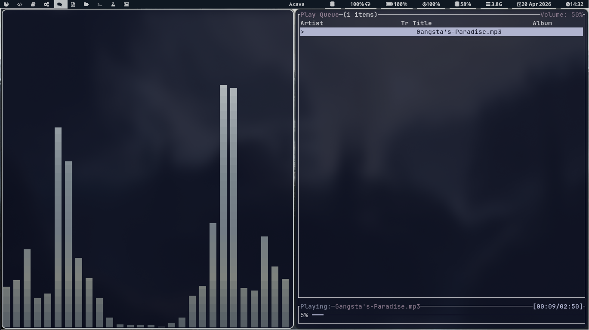

# Dotfiles



<br>



## Usage
```bash
cd $HOME
git clone https://github.com/Aethenyx/dotfiles ~/.dotfiles
cd ~/.dotfiles
./install.sh

## OR ##
## Use auto-yes (you won't be asked to select any packages, everything will be selected by default)
./install.sh --yes
```
